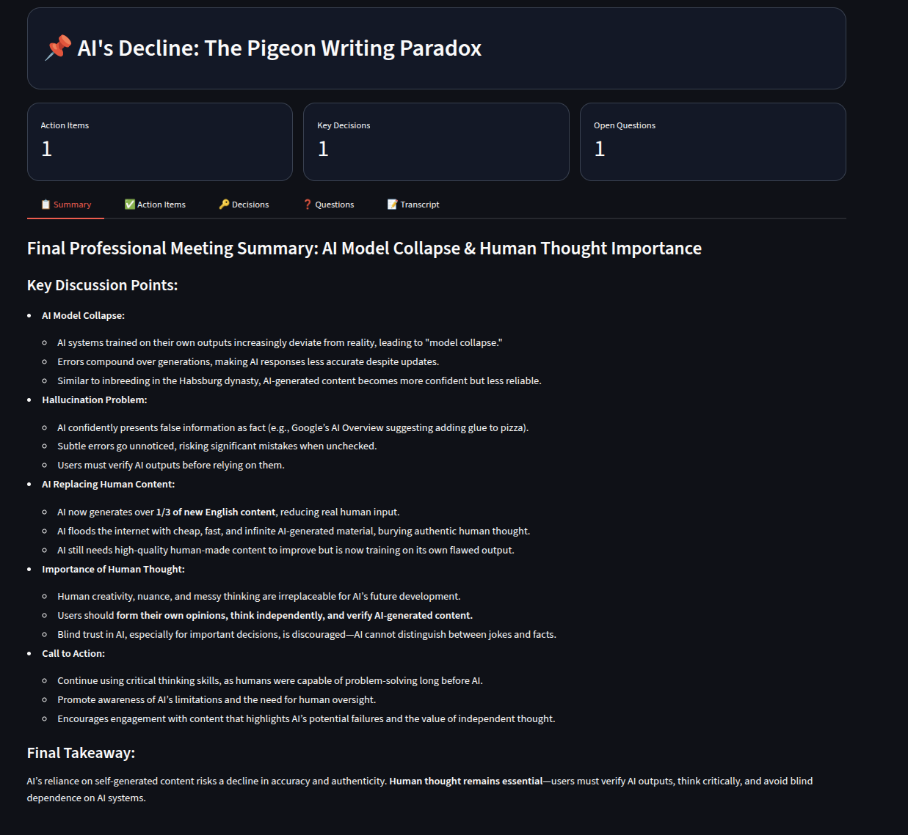
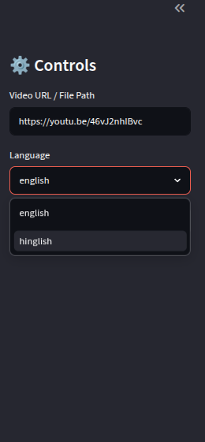
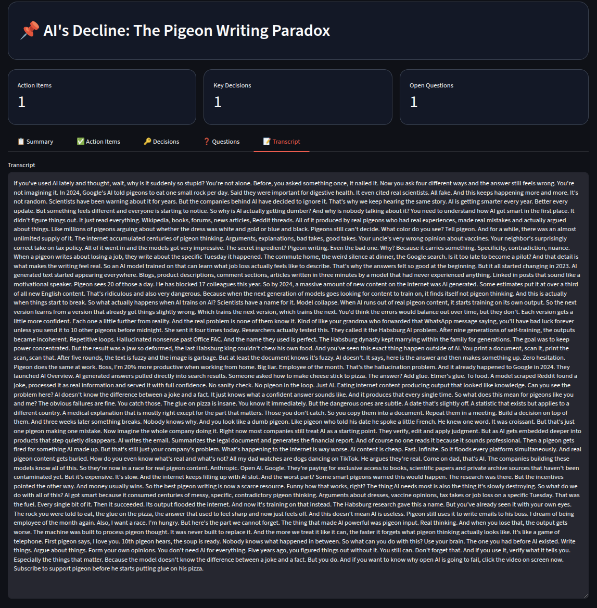
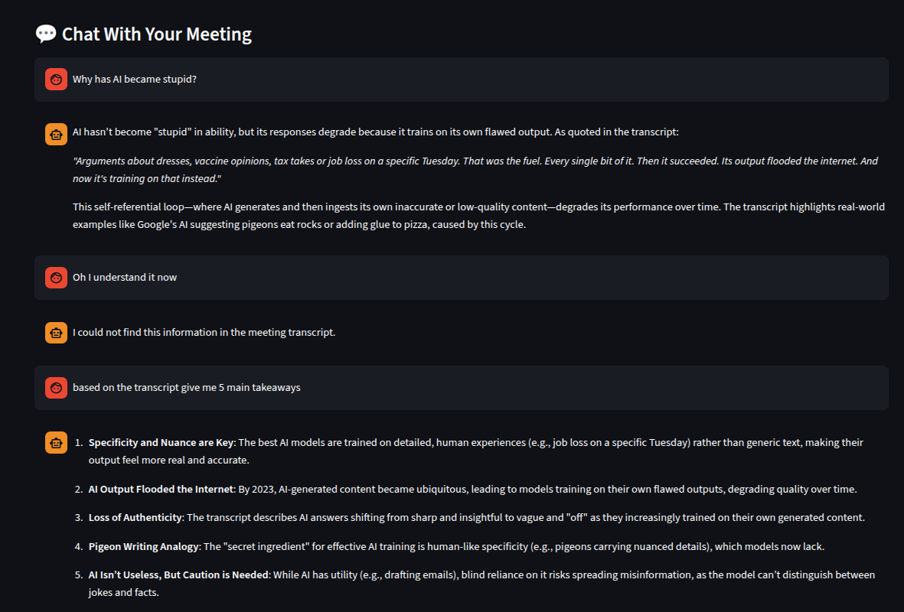

# LangVid 🎬

**Turn any video or meeting recording into a transcript, summary, action items, and a chat partner — powered by LLMs and RAG.**

LangVid ingests a YouTube link or local audio/video file, transcribes it, and runs it through a pipeline that extracts a title, summary, action items, key decisions, and open questions. The full transcript is also indexed into a RAG (Retrieval-Augmented Generation) chain so you can ask follow-up questions and get answers grounded in what was actually said.

The project ships with three ways to use it:
- A **CLI** (`main.py`) for quick, scriptable runs
- A **Streamlit UI** (`app.py`) for a fast, no-build interactive interface

---
## Snapshots

#### Home


#### Controls


#### Transcript


#### Chat


---


---

## Features

-  **Flexible input** — YouTube URLs or local audio/video files
-  **Transcription** — supports English and Hinglish
-  **Auto-generated titles** for each session
-  **Summarization** of the full conversation
-  **Action item extraction**
-  **Key decision extraction**
-  **Open question extraction**
-  **Chat with your transcript** via a RAG-powered Q&A engine
-  **Three interfaces**: CLI, Streamlit, and a React + FastAPI web app

---

## Project Structure

```
LANGVID/
├── core/                       # Pipeline logic
│   ├── extractor.py            # Action items / decisions / questions
│   ├── rag_engine.py           # RAG chain construction + Q&A
│   ├── summarizer.py           # Summary + title generation
│   ├── transcriber.py          # Audio → text transcription
│   └── vector_store.py         # Embedding storage for RAG
│
├── utils/
│   └── audio_processor.py      # Input handling: URL/file → audio chunks
│
├── vector_db/                  # Persisted vector store data
├── downloads/                  # Downloaded/extracted media
├── main.py                     # CLI entry point
├── app.py                      # Streamlit UI entry point
├── requirements.txt
└── .env                        # API keys / config (not committed)
```

---

## ⚙️ Requirements

- Python 3.10+
- Langchain, ChromDB, OpenAI Whisper, Sarvam TTS saaras:v3, Mistral OS Model
- API keys for whichever LLM/transcription providers `core/` is configured to use (set in `.env`)

---

## 🚀 Getting Started

### 1. Clone and set up the Python environment

```bash
git clone <repo-url>
cd LANGVID
python -m venv langvid_venv
source langvid_venv/bin/activate   # Windows: langvid_venv\Scripts\activate
pip install -r requirements.txt
```

### 2. Configure environment variables

Create a `.env` file in the project root with the keys your `core/` modules expect, e.g.:

```env
MISTRAL_API_KEY=your_key_here
SARVAM_API_KEY=your_key_here
# add any other provider keys used by transcriber.py / summarizer.py / rag_engine.py
```

### 3. Run it — pick an interface

**Option A — CLI**

```bash
python main.py
```
You'll be prompted for a YouTube URL or file path, then a language. Once the pipeline finishes, you can chat with the transcript directly in the terminal.

**Option B — Streamlit UI**

```bash
pip install streamlit
streamlit run app.py
```
Open the local URL Streamlit prints (typically `http://localhost:8501`).

---

##  How It Works

1. **`process_input(source)`** — pulls audio from a YouTube URL or local file and splits it into chunks.
2. **`transcribe_all(chunks, language)`** — transcribes each chunk and stitches together the full transcript.
3. **`generate_title` / `summarize`** — produce a session title and summary from the transcript.
4. **`extract_action_items` / `extract_key_decisions` / `extract_questions`** — pull structured insights out of the transcript.
5. **`build_rag_chain(transcript)`** — embeds the transcript into a vector store for retrieval.
6. **`ask_question(rag_chain, question)`** — answers follow-up questions grounded in the transcript via retrieval-augmented generation.

The CLI, Streamlit app, and FastAPI backend are all thin wrappers around this same pipeline — none of them duplicate the core logic.

---


## Roadmap Ideas

- [ ] Multipart file upload endpoint (currently file input assumes a server-accessible path)
- [ ] Streaming/SSE pipeline progress instead of a single blocking request
- [ ] Persistent session store (Redis/DB) for multi-user deployments
- [ ] Support for additional languages beyond English/Hinglish
- [ ] Authentication for the API layer

---

##  License

MIT License